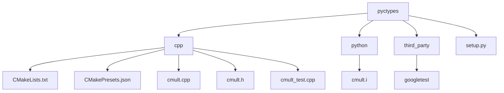

# ctypes and SWIG for C++ binding

- [ctypes and SWIG for C++ binding](#ctypes-and-swig-for-c-binding)
  - [Hello World](#hello-world)
    - [Using cyptes for C++ binding](#using-cyptes-for-c-binding)
    - [Using SWIG for C++ binding](#using-swig-for-c-binding)
    - [Using setuptools and `setup.py`](#using-setuptools-and-setuppy)
  - [Project structure](#project-structure)
  - [Steps to build](#steps-to-build)
  - [When to USE SWIG?](#when-to-use-swig)

<!-- ===================================  =================================== -->
## Hello World

### Using cyptes for C++ binding
>
> **:warning:** ctypes does not support directly accessing global variables from shared libraries. Instead, we can create a function that returns the value of the constant.

In folder, `pyctypes_simple`:

```bash
#!/bin/bash

# clean everything
rm -f add_floats.h add_floats.cpp add_floats.dylib add_floats.py

# Create the C++ header file
cat > add_floats.h << EOF
extern "C" {
    float add_floats(float a, float b);
}
EOF

# Create the C++ source file
cat > add_floats.cpp << EOF
#include "add_floats.h"

float add_floats(float a, float b) {
    return a + b;
}
EOF

# Compile the C++ file into a shared library
g++ -shared -o add_floats.dylib add_floats.cpp

# Create the Python file
cat > add_floats.py << EOF
import ctypes

# Load the shared library
add_floats_lib = ctypes.CDLL('./add_floats.dylib')

# Define the argument types and return type of the add_floats function
add_floats_lib.add_floats.argtypes = [ctypes.c_float, ctypes.c_float]
add_floats_lib.add_floats.restype = ctypes.c_float

def add_floats(a, b):
    return add_floats_lib.add_floats(a, b)

# Test the function
result = add_floats(3.5, 2.5)
print(f"3.5 + 2.5 = {result}")
EOF

# Run the Python script
python add_floats.py
```

### Using SWIG for C++ binding

> **:warning:** using `gcc` on macOS M1 results in `ld: symbol(s) not found for architecture arm64`, add `-undefined dynamic_lookup` to fix it.

The -undefined dynamic_lookup flag is used to build a shared library _cmult.so from the cmult_wrap.cxx source file and the libcmult.dylib library. By using this flag, any undefined symbols in cmult_wrap.cxx that are expected to be provided by the Python interpreter or other dynamic libraries will be resolved at runtime when the_cmult.so library is loaded.

This approach is particularly useful when building Python extension modules, as it allows the extension module to be linked against the Python interpreter dynamically, without requiring the Python library to be linked statically during the build process. This can help reduce the size of the resulting shared library and improve compatibility across different Python installations.

```bash
#!/bin/bash

# clean everything
rm -f add_floats.h add_floats.cpp add_floats.dylib add_floats_test.py

# Create the C++ header file
cat > add_floats.h << EOF
extern "C" {
    float add_floats(float a, float b);
}
EOF

# Create the C++ source file
cat > add_floats.cpp << EOF
#include "add_floats.h"

float add_floats(float a, float b) {
    return a + b;
}
EOF

# create a SWIG interface file
cat > add_floats.i << EOF
%module add_floats

%{
#include "add_floats.h"
%}

%include "add_floats.h"
EOF

# Compile the C++ file
clang++ -arch arm64 -c -fpic add_floats.cpp -o add_floats.o

# Generate the SWIG wrapper
swig -c++ -python add_floats.i

# Compile the SWIG wrapper
clang++ -arch arm64 -c -fpic add_floats_wrap.cxx -I "$(python -c "import sysconfig; print(sysconfig.get_path('include'))")" -o add_floats_wrap.o

# Link the object files and create the shared library
clang++ -arch arm64 -shared add_floats.o add_floats_wrap.o -o _add_floats.so -undefined dynamic_lookup

# Clean up the temporary files
rm add_floats.o add_floats_wrap.cxx add_floats_wrap.o

# Create the Python file
cat > add_floats_test.py << EOF
import add_floats

result = add_floats.add_floats(3.5, 2.5)
print("The sum of 3.5 and 2.5 is:", result)
EOF

# Run the Python script
python add_floats_test.py
```

### Using setuptools and `setup.py`

```python
from setuptools import setup, Extension
from setuptools.command.build_ext import build_ext
import sys
import os


class BuildExtension(build_ext):

    def run(self):
        # Run the original build_ext command
        build_ext.run(self)


# Define the extension module
add_floats_module = Extension(
    "add_floats", sources=["add_floats.cpp"], extra_compile_args=["-std=c++11"], language="c++"
)

# Run the setup
setup(
    name="add_floats",
    version="0.1",
    description="A ctypes C++ binding example",
    ext_modules=[add_floats_module],
    cmdclass={"build_ext": BuildExtension},
)
```

Use `libraries` to specify the names of shared or static libraries that the linker should search for in the specified `library_dirs`, and use `extra_objects` to provide the *full path and file name* for additional object files or static libraries that should be linked directly with the extension module.

```python
setuptools.Extension(
        'metalcompute',
        ['src/metalcompute.c'],
        extra_compile_args=["-mmacosx-version-min=11.0","-arch arm64","-arch x86_64","-Wno-unused-command-line-argument"],
        extra_link_args=["-mmacosx-version-min=11.0","-arch arm64","-arch x86_64","-Wno-unused-command-line-argument"],
        library_dirs=[".","/usr/lib","/usr/lib/swift"],
        libraries=["swiftFoundation","swiftMetal"],
        extra_objects=["build/swift/metalcomputeswift.a"])
```

is equal to

```bash
clang -c src/metalcompute.c -o src/metalcompute.o -mmacosx-version-min=11.0 -arch arm64 -arch x86_64 -Wno-unused-command-line-argument
clang -shared -o metalcompute.so src/metalcompute.o build/swift/metalcomputeswift.a -L. -L/usr/lib -L/usr/lib/swift -lswiftFoundation -lswiftMetal -mmacosx-version-min=11.0 -arch arm64 -arch x86_64 -Wno-unused-command-line-argument
```
<!-- ===================================  =================================== -->
## Project structure

```bash
pyctypes
├── cpp
│   ├── out/build
│   ├── CMakeLists.txt
│   ├── CMakePresets.json
│   ├── cmult.cpp
│   ├── cmult.h
│   ├── cmult_test.cpp
├── python
│   ├── cmult.i
├── third_party
│   ├── googletest
├── setup.py
```



<!-- ===================================  =================================== -->
## Steps to build

1. Write C++ code in `cpp` folder
2. Write `CMakelists.txt` in `cpp` folder
3. Write `CMakePresets.json` in `cpp` folder, include: `configurePresets`, `buildPresets`, `testPresets`
4. Download `googletest` in `third_party` folder
5. Configure, build and test in `cpp` folder (to clean just remove `out/build` folder), the shared library will be generated in `out/build/libcmult.dylib` folder:

    ```bash
    cmake --preset configure
    cmake --build --preset build
    ctest --preset test
    ```

6. Write `cmult.i` in `python` folder

    ```python
    %module cmult

    %{
    #include "cpp/cmult.h"
    %}

    %include "cpp/cmult.h"
    ```

7. Run `swig` in `python` folder, this generate two files `cmult_wrap.cxx` and `cmult.py`

    ```bash
    swig -c++ -python python/cmult.i
    ```

8. Write `setup.py` in `pyctypes` folder
9. Build and install python package:

    ```bash
    python setup.py build
    python setup.py install
    ```

10. Test python package:

    ```python
    import cmult
    cmult.cmult(2, 3)
    ```

11. For debugging:

    ```bash
    python -m pdb setup.py build
    ```

<!-- ===================================  =================================== -->
## When to USE SWIG?

1. Rapidly wrap just several functions from some C++ library for end use.
2. If one needs to wrap C++ code for several languages.
3. needs to distribute the code for several languages.
